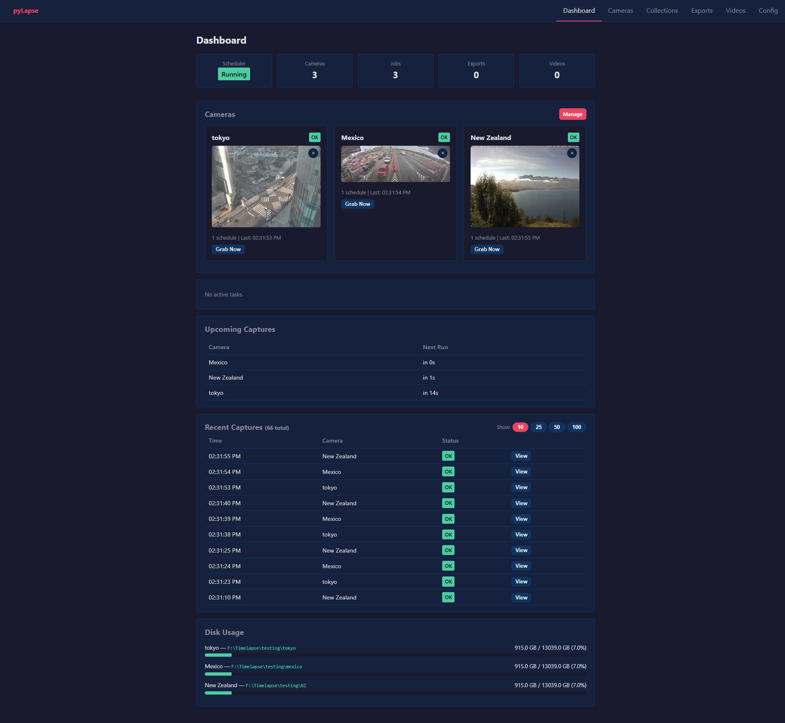
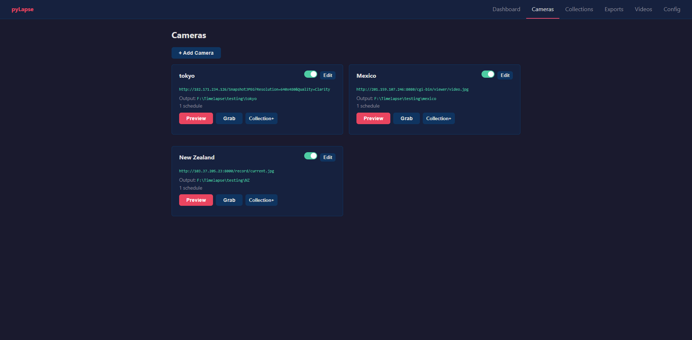
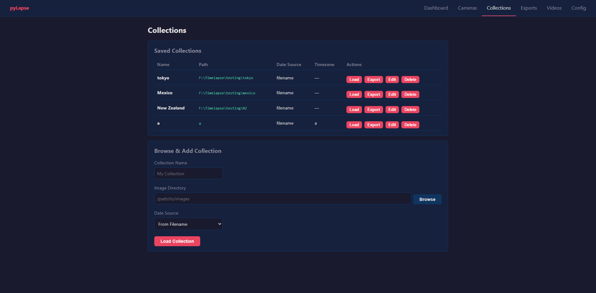
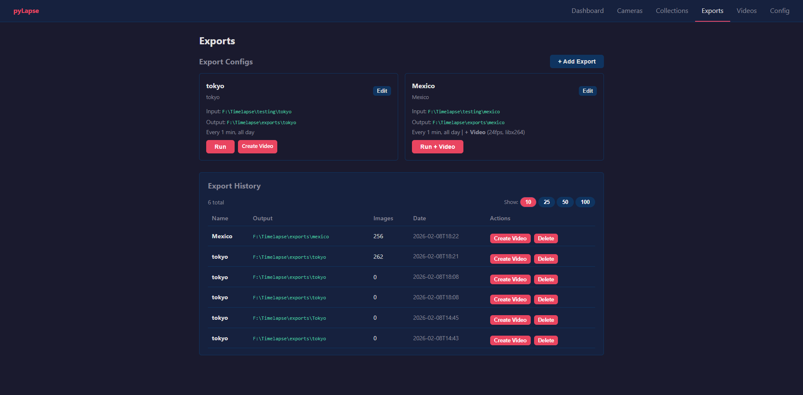
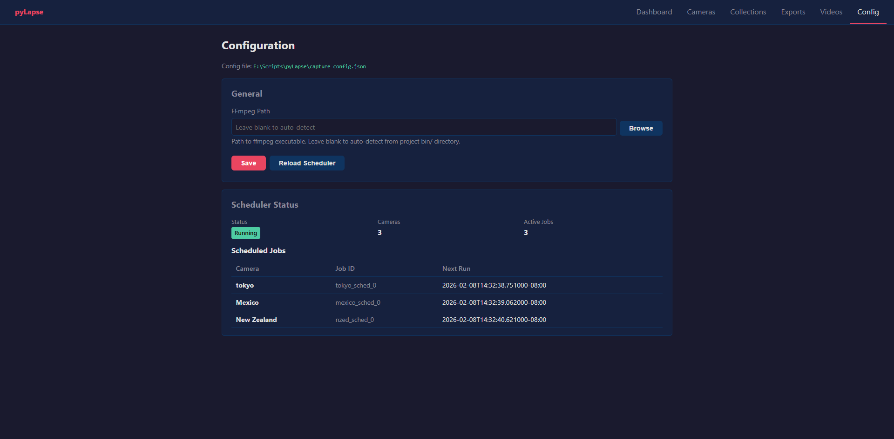

# pyLapse


Automatically save images from IP cameras into collections for export and video rendering, with detailed scheduling and export options.

---

I started this project back in 2016 to do a long-term timelapse of some plants I was growing. The original setup was three old cell phones running IP Webcam, pointed out windows at different angles, capturing a frame every few minutes. A Python script on my desktop would pull snapshots over the local network on a cron schedule, sort them by date, and stitch together daily timelapses. It was janky but it worked — I ran it from April through October and got some great footage of the whole growing season.

The code sat mostly untouched for years after that. In 2026 I revisited it with the help of AI coding agents (Claude Code) to clean up the core library, add proper timezone support and flexible filename parsing, and build a full web dashboard with FastAPI and htmx. What started as a single script is now something I'd actually recommend to other people.

---

## Installation

**For video rendering:** download [ffmpeg](https://ffmpeg.org/download.html) and place the executable in the project's `bin/` directory, or set `ffmpeg_path` in `capture_config.json`.

## Quick Start

### Web Dashboard (FastAPI + htmx)

The easiest way to use pyLapse. A browser-based dashboard for managing cameras, scheduling captures, running exports, and rendering videos.

```bash
# Windows
start_ui.bat

# Linux / macOS
./start_ui.sh

# PowerShell
.\start_ui.ps1
```

Or run directly:

```bash
pip install -r requirements.txt
python web_ui.py [--host 0.0.0.0] [--port 8000] [--config capture_config.json]
```

The launcher scripts will create a virtual environment and install dependencies automatically on first run.

**Dashboard features:**
- Live camera preview and on-demand image grab
- Per-camera and per-schedule enable/disable toggles
- Auto-create collections from camera output directories
- Cron and interval-based capture scheduling
- Configurable filename formatting, image quality, and resize on capture
- ISO 8601 filenames with UTC offset (e.g. `cam-2026-02-09T14-30-00+09.00.jpg`)
- Per-camera timezone with searchable IANA timezone picker (598 timezones)
- Timezone-shifted filenames and timestamp overlays (e.g. capture in Tokyo time from a US server)
- Camera description field for notes
- Granular auto-refreshing dashboard sections (no full-page flicker)





**Collections & Exports:**
- Browse image collections with per-day counts
- Per-collection timezone setting for source timezone tracking
- Cron-filtered exports with real-time progress (SSE)
- Timestamp overlay with font picker (system, bundled Roboto, Google Fonts)
- Timezone-aware timestamp rendering: converts between source and display timezones (e.g. Tokyo → LA)
- Create exports standalone or attached to a collection
- Image resize, quality, and optimization options
- Paginated history lists (10, 25, 50, 100 items)





**Video rendering:**
- Render image sequences to MP4 (H.264, H.265, MPEG-4)
- Real-time render progress via SSE
- In-browser video preview and playback
- Chain video creation directly after export


**Config:**
- Visual config editor with folder browser
- Scheduler reload without restart



### Auto-capture (headless)

Configure cameras and schedules in `capture_config.json` (see `capture_config.example.json`):

```bash
python autocapture.py
```

### Python API

```python
from pyLapse.img_seq import Collection

# Load images from a directory
collection = Collection("My Timelapse", "/path/to/output", "/path/to/images")
print(collection)
# Image Collection: My Timelapse, Location: /path/to/images, Image Count: 12020

# Create a cron-filtered export (every 15 minutes, every other hour)
collection.add_export("Day Export", subdir="day", minute="*/15", hour="*/2")

# Run the export
collection.export.run(
    "Day Export", "/path/to/export",
    prefix="Timelapse ", drawtimestamp=True, optimize=True,
)
```

### Camera operations

```python
from pyLapse.img_seq import Camera

webcam = Camera("Front Porch", "http://192.168.1.100:8080/photoaf.jpg")

# Grab and save a single image
webcam.save_image("/path/to/output", prefix="FrontPorch ")
```

### Video rendering (CLI)

```bash
python render_video.py /path/to/image/sequence output.mp4 --fps 24 --pattern "*.jpg"
```

```python
from pyLapse.img_seq import render_sequence_to_video

render_sequence_to_video(
    input_dir="/path/to/image/sequence",
    output_path="output.mp4",
    fps=24,
    pattern="*.jpg",
)
```

## Project Structure

```
pyLapse/
  img_seq/            Core library
    cameras.py          Camera class for IP camera image capture
    collections.py      Collection and Export classes for organizing/filtering images
    fonts.py            Font discovery (system, bundled, Google Fonts)
    fonts/              Bundled font files (Roboto-Regular.ttf)
    image.py            ImageIO, ImageSet - image loading, saving, timestamps
    lapsetime.py        Time-based filtering (cron-style, dayslice, nearest-match)
    settings.py         Example configuration templates
    utils.py            Threading helpers, URL validation, file utilities
    video.py            ffmpeg-based video rendering with progress
    tests.py            pytest test suite
  web/                Web dashboard (FastAPI + htmx)
    app.py              FastAPI app with lifespan scheduler management
    scheduler.py        BackgroundScheduler singleton, config loading, capture jobs
    tasks.py            Background task manager with progress tracking
    collections_store.py  Persistent collection storage (JSON)
    history_store.py    Persistent export/video history (JSON)
    routes/             Route modules (dashboard, cameras, collections, exports, videos, config, api)
    templates/          Jinja2 HTML templates with htmx partials
    static/             CSS (dark theme), JavaScript (schedule picker, folder browser, modals)
autocapture.py        CLI headless auto-capture scheduler
web_ui.py             Web dashboard entry point
render_video.py       CLI video renderer
start_ui.bat          Windows launcher (creates venv, installs deps, starts server)
start_ui.sh           Linux/macOS launcher
start_ui.ps1          PowerShell launcher
```

## Running Tests

```bash
pytest pyLapse/img_seq/tests.py -v
```

## Roadmap

Planned features and ideas for future development:

**Image Post-Processing Pipeline**
- Tilt-shift miniature effect (adjustable focal band, blur strength)
- Color grading / LUT application
- Auto white-balance correction across sequences
- HDR tone mapping for high-contrast scenes
- Vignette, contrast, saturation adjustments
- Deflicker / exposure smoothing between frames
- Watermark overlay (image or text, configurable position and opacity)

**Video Enhancements**
- Motion interpolation (frame blending / optical flow for smoother output)
- Speed ramping (variable speed within a single timelapse)
- Transition effects between days or scenes
- Audio track attachment (ambient audio, music)
- GIF export alongside MP4

**Smart Filtering & Analysis**
- Weather-based filtering (skip overcast/rainy frames via brightness analysis)
- Duplicate/near-duplicate frame detection and removal
- Best-frame-per-day selection (sharpness, exposure scoring)
- Motion detection highlights (flag frames with significant change)
- Star trail stacking mode for night sequences

**UI & Workflow**
- Multi-collection batch exports (queue multiple exports)
- Export templates / presets (save and reuse export configurations)
- Side-by-side comparison view (before/after processing)
- Image thumbnail grid browser with day navigation
- Mobile-friendly responsive layout
- User authentication for remote access
- Webhook / notification support (email, Discord, Slack on export complete)

**Platform & Integration**
- RTSP stream support (in addition to HTTP snapshot URLs)
- Cloud storage backends (S3, Google Drive, network shares)
- Docker container packaging
- REST API for headless automation beyond the web UI
